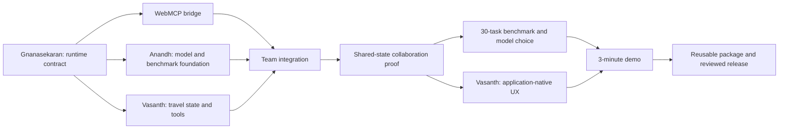

# Team Work Split

## Project goal

Build a reusable TypeScript WebMCP agent runtime and a collaboration-first travel showcase. The same semantic tool surface must work for external agents and the in-app agent without duplicated schemas or executors.

## Owners

| Person | Primary ownership | Secondary ownership | Planned paths |
| --- | --- | --- | --- |
| **Gnanasekaran** | Runtime Core, WebMCP bridge, validation, approval, events, stop conditions, final integration | architecture, release, cross-layer review | `packages/runtime/`, integration docs |
| **Anandh** | local model adapters, prompting, tool retrieval, benchmark harness and results | model selection, latency/memory and failure analysis | `packages/model-adapters/`, `benchmarks/` |
| **Vasanth** | deterministic travel state/tools, collaborative app and UI/UX | accessibility, responsive polish, deployment readiness | `apps/travel-showcase/` |

## Shared contracts

| Contract | Owner | Consumers |
| --- | --- | --- |
| `RuntimeTool` | Gnanasekaran | Anandh, Vasanth |
| `RuntimeModel` | Gnanasekaran defines; Anandh implements | Runtime Core |
| `AgentRunOptions`, `AgentEvent`, `AgentRunResult` | Gnanasekaran | Anandh, Vasanth |
| travel entities and state revision | Vasanth defines; Gnanasekaran enforces | runtime and UI |
| benchmark task/result schema | Anandh | all three |

Interface changes require the owner, every current consumer and a migration test or explicit compatibility note.

## Day 1 — Parallel foundations

### Gnanasekaran

- Port and independently review the bounded runtime foundation from Latchwork PR #7.
- Establish the clean package public API, cancellation, validation, approval and trace contracts.
- Add unit tests for dynamic tools, multi-step calls, failures, limits and mutation isolation.

### Anandh

- Define benchmark task/result schemas and failure taxonomy.
- Create the first 10 deterministic smoke tasks.
- Record the candidate local-model matrix and measurable selection gates.
- Do not tune prompts before the baseline runner exists.

### Vasanth

- Define deterministic Japan inventory and travel entities.
- Specify 8–12 tool names, schemas, read/write annotations and expected state transitions.
- Produce the smallest application-state and collaboration-flow contract before visual implementation.

### Team checkpoint

Freeze the Day 2 shared interfaces and merge order. No owner begins integration against unreviewed contract assumptions.

## Day 2 — Runtime, models and domain tools

- **Gnanasekaran:** implement the canonical WebMCP registration/in-app provider bridge and integration tests.
- **Anandh:** implement the first `RuntimeModel` adapter, structured prompt, retrieval baseline and deterministic runner.
- **Vasanth:** implement typed travel state plus the first 6–8 read/stage tools with domain tests.
- **Checkpoint:** prove one tool definition can be registered externally and consumed in-app.

## Day 3 — Collaborative vertical slice

- **Gnanasekaran:** integrate runtime, model adapter, travel tools, approval and stale-state rejection.
- **Anandh:** make the hero flow reuse intermediate IDs over 2–6 calls and publish smoke results.
- **Vasanth:** deliver goal input, itinerary/budget state, entity trace, staged-change approval and one manual edit.
- **Checkpoint:** run the Japan goal, manually change the itinerary, then prove the next run repairs current state without booking.

## Day 4 — Local-model go/no-go

- Anandh leads at least 30 deterministic tasks across selection, ID reuse, state changes, recovery and confirmation.
- Gnanasekaran separates runtime defects from model/retrieval failures.
- Vasanth verifies benchmark tasks match visible application states.
- The team selects the local showcase workflow from evidence, not preference.

## Day 5 — Application-native showcase

- Vasanth leads the complete 8–12 tool app, live trace, confirmations, highlights, undo, backend indicator, accessibility and responsive polish.
- Anandh supplies measured progress/error/limitation copy.
- Gnanasekaran verifies policy, stale-state recovery and external/in-app WebMCP parity.

## Day 6+ — Package and release proof

- Extract the proven runtime package and add a second thin integration fixture.
- Add cloud-adapter parity without changing policy semantics.
- Publish benchmark evidence, architecture, integration guide, limitations and a 3-minute demo script.
- Require full local verification, author self-review, non-author review, green CI and explicit merge approval for every PR.
- Require separate explicit approval before public deployment.

## Branch and merge strategy

- Gnanasekaran: `feat/runtime-*` and `fix/runtime-*`.
- Anandh: `feat/model-*` and `bench/*`.
- Vasanth: `feat/travel-*` and `feat/ui-*`.
- Start from current `main` after prerequisites merge; avoid unreviewed stacked branches.
- Keep PRs inside owner paths. Declare shared-file changes before editing.
- Merge order for Day 1: Runtime contract, model/benchmark foundation, travel-domain foundation.
- Integration begins only after all required contracts are on `main`.

## What each person avoids modifying

| Person | Avoid without coordination |
| --- | --- |
| Gnanasekaran | app layout/styles, travel content, prompts, benchmark scoring/results |
| Anandh | runtime loop/policy, tool executors, application state, UI and hosting |
| Vasanth | runtime contracts, adapter internals, prompts/retrieval, benchmark scoring and CI policy |

No one independently changes root manifests, lockfiles, CI, hosting or public interfaces while another open PR touches them.

## If someone finishes early

- **Gnanasekaran:** add adversarial cancellation, stale-state, duplicate-tool, malformed-output and resource-limit tests.
- **Anandh:** add deterministic tasks, failure labels and prompt/latency/memory measurements.
- **Vasanth:** add accessibility, empty/error/loading, keyboard/touch and trace-clarity cases.
- **Anyone:** review another owner's PR or write acceptance tests for the next dependency.

## Day 3 success gate

Day 3 passes only when:

- the shared runtime, model adapter and travel tool surface are merged through reviewed PRs;
- one goal completes with 2–6 validated tool calls and at least one reused intermediate identifier;
- non-read-only actions pause for visible approval;
- no booking capability exists;
- a human changes the same application state;
- the next run reads the new revision and cannot overwrite it with stale work;
- the trace identifies the active action and affected entity;
- deterministic failure, cancellation, approval, step-limit and recovery tests pass;
- every merged implementation PR has local evidence, green CI and a non-author review.

## Dependency graph

## Source references

- **WebMCP Agent-Native Runtime Winning PRD v3**, sections 49–58 (pages 15–19): final product positioning, collaboration-first travel showcase, benchmark proof, priority order and staged execution plan.
- [Latchwork PR #7](https://github.com/gnanam1990/latchwork/pull/7): reviewed source evidence for the bounded runtime foundation. It must be independently revalidated before any code is ported.

The source DOCX is intentionally not committed to this public repository. These references describe the planning basis; they do not claim that the planned runtime or showcase is already implemented here.
